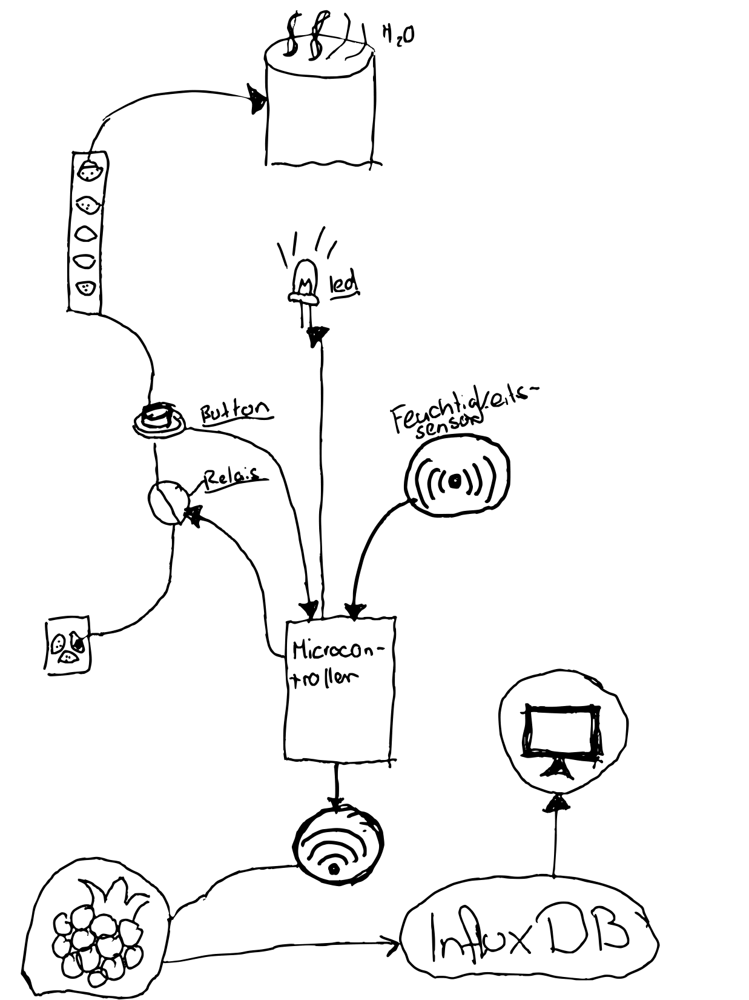
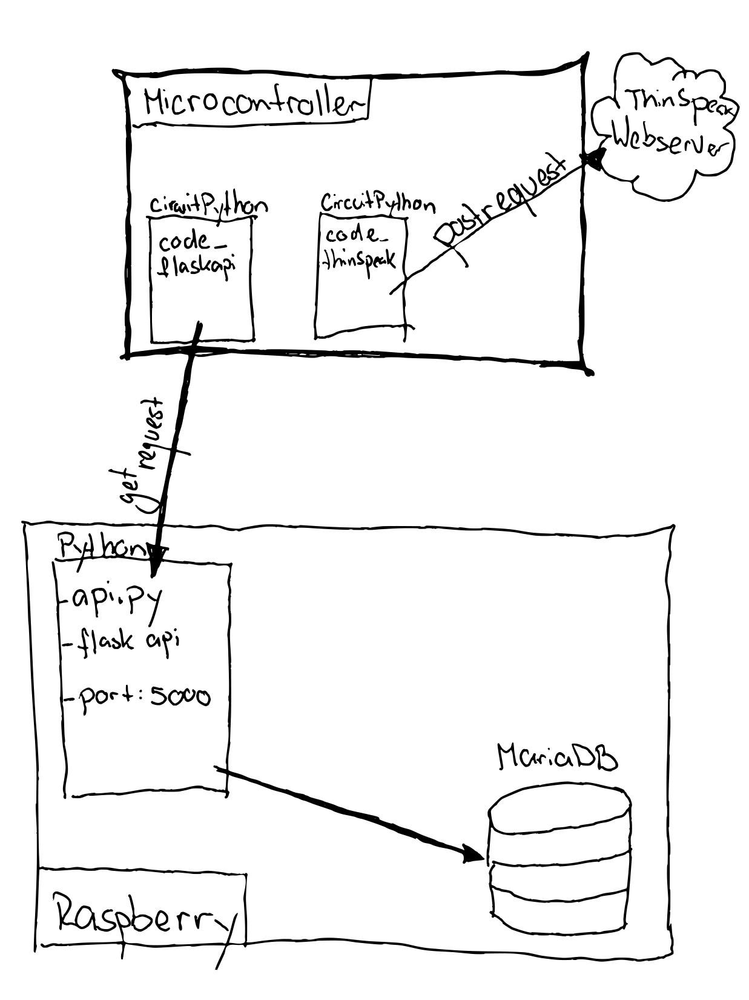

This is a project for the module internet of things data analysis made by Riccard Nef in 2021.

Goal:
The goal is to make a adafruit microcontroller into a device, who can control a humidifier automatlicly controled by a moisture meter. 
The data from the sensors should be stored in a database and the device should also have a manuel button. 

The exact structure is shown in the following sketches:

